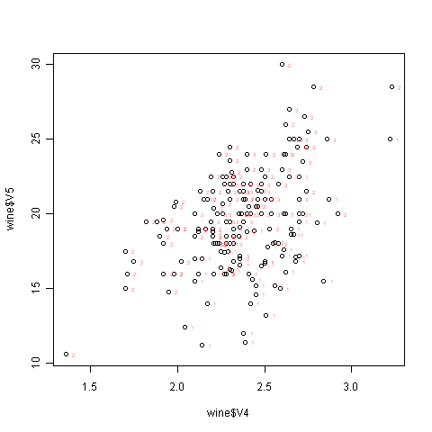
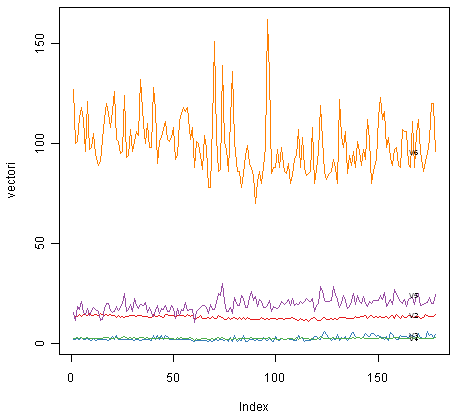
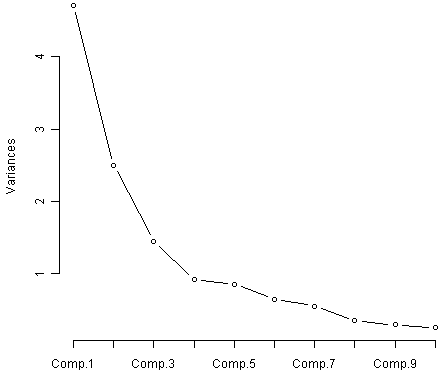

Using R for Multivariate Analysis
=================================

Multivariate Analysis
---------------------

This booklet itells you how to use the R statistical software to carry out some simple multivariate analyses.

This booklet assumes that the reader has some basic knowledge of multivariate analyses, and
the principal focus of the booklet is not to explain multivariate analyses, but rather 
to explain how to carry out these analyses using R.

If you are new to multivariate analysis, and want to learn more about any of the concepts
presented here, I would highly recommend the Open University book 
"Multivariate Analysis" (product code M249/03), available from
from `the Open University Shop <http://www.ouw.co.uk/store/>`_.

In the examples in this booklet, I will be using data sets from the UCI Machine
Learning Repository, `http://archive.ics.uci.edu/ml <http://archive.ics.uci.edu/ml>`_.

There is a pdf version of this booklet available at
`https://github.com/avrilcoghlan/LittleBookofRTimeSeries/raw/master/_build/latex/MultivariateAnalysis.pdf <https://github.com/avrilcoghlan/LittleBookofRTimeSeries/raw/master/_build/latex/MultivariateAnalysis.pdf>`_.

If you like this booklet, you may also like to check out my booklet on using
R for biomedical statistics, 
`http://a-little-book-of-r-for-biomedical-statistics.readthedocs.org/
<http://a-little-book-of-r-for-biomedical-statistics.readthedocs.org/>`_,
and my booklet on using R for time series analysis,
`http://a-little-book-of-r-for-time-series.readthedocs.org/
<http://a-little-book-of-r-for-time-series.readthedocs.org/>`_.

Reading Multivariate Analysis Data into R
-----------------------------------------

The first thing that you will want to do to analyse your multivariate data will be to read
it into R, and to plot the data. You can read data into R using the read.table() function.

For example, the file `http://archive.ics.uci.edu/ml/machine-learning-databases/wine/wine.data
<http://archive.ics.uci.edu/ml/machine-learning-databases/wine/wine.data>`_
contains data on concentrations of 13 different chemicals in wines grown in the same region in Italy that are
derived from three different cultivars.

The data set looks like this:

.. highlight:: r

::

    1,14.23,1.71,2.43,15.6,127,2.8,3.06,.28,2.29,5.64,1.04,3.92,1065
    1,13.2,1.78,2.14,11.2,100,2.65,2.76,.26,1.28,4.38,1.05,3.4,1050
    1,13.16,2.36,2.67,18.6,101,2.8,3.24,.3,2.81,5.68,1.03,3.17,1185
    1,14.37,1.95,2.5,16.8,113,3.85,3.49,.24,2.18,7.8,.86,3.45,1480
    1,13.24,2.59,2.87,21,118,2.8,2.69,.39,1.82,4.32,1.04,2.93,735
    ... 

There is one row per wine sample.
The first column contains the cultivar of a wine sample (labelled 1, 2 or 3), and the following thirteen columns
contain the concentrations of the 13 different chemicals in that sample.
The columns are separated by commas. 

When we read the file into R using the read.table() function, we need to use the "sep="
argument in read.table() to tell it that the columns are separated by commas.
That is, we can read in the file using the read.table() function as follows:

.. highlight:: r

::

    > wine <- read.table("http://archive.ics.uci.edu/ml/machine-learning-databases/wine/wine.data", sep=",")
    > wine
         V1    V2   V3   V4   V5  V6   V7   V8   V9  V10       V11   V12  V13  V14
     1    1 14.23 1.71 2.43 15.6 127 2.80 3.06 0.28 2.29  5.640000 1.040 3.92 1065
     2    1 13.20 1.78 2.14 11.2 100 2.65 2.76 0.26 1.28  4.380000 1.050 3.40 1050
     3    1 13.16 2.36 2.67 18.6 101 2.80 3.24 0.30 2.81  5.680000 1.030 3.17 1185
     4    1 14.37 1.95 2.50 16.8 113 3.85 3.49 0.24 2.18  7.800000 0.860 3.45 1480
     5    1 13.24 2.59 2.87 21.0 118 2.80 2.69 0.39 1.82  4.320000 1.040 2.93  735
     ...
     176  3 13.27 4.28 2.26 20.0 120 1.59 0.69 0.43 1.35 10.200000 0.590 1.56  835
     177  3 13.17 2.59 2.37 20.0 120 1.65 0.68 0.53 1.46  9.300000 0.600 1.62  840
     178  3 14.13 4.10 2.74 24.5  96 2.05 0.76 0.56 1.35  9.200000 0.610 1.60  560
     
In this case the data on 178 samples of wine has been read into the variable 'wine'.

Plotting Multivariate Data
--------------------------

Once you have read a multivariate data set into R, the next step is usually to make a plot of the data.

A Matrix Scatterplot
^^^^^^^^^^^^^^^^^^^^

One common way of plotting multivariate data is to make a "matrix scatterplot", showing each pair of
variables plotted against each other. We can use the "scatterplotMatrix()" function from the "car"
R package to do this. To use this function, we first need to install the "car" R package 
(for instructions on how to install an R package, see `How to install an R package 
<./installr.html#how-to-install-an-r-package>`_).

Once you have installed the "car" R package, you can load the "car" R package by typing:

.. highlight:: r

::

    > library("car")

You can then use the "scatterplotMatrix()" function to plot the multivariate data. 

To use the scatterplotMatrix() function, you need to give it as its input the variables
that you want included in the plot. Say for example, that we just want to include the
variables corresponding to the concentrations of the first five chemicals. These are stored in 
columns 2-6 of the variable "wine". We can extract just these columns from the variable
"wine" by typing:

::

    > wine[2:6]
             V2   V3   V4   V5  V6  
      1   14.23 1.71 2.43 15.6 127 
      2   13.20 1.78 2.14 11.2 100
      3   13.16 2.36 2.67 18.6 101 
      4   14.37 1.95 2.50 16.8 113
      5   13.24 2.59 2.87 21.0 118 
      ...

To make a matrix scatterplot of just these 13 variables using the scatterplotMatrix() function we type:

::

    > scatterplotMatrix(wine[2:6])

|image1|

In this matrix scatterplot, the diagonal cells show histograms of each of the variables, in this
case the concentrations of the first five chemicals (variables V2, V3, V4, V5, V6). 

Each of the off-diagonal cells is a scatterplot of two of the five chemicals, for example, the second cell in the
first row is a scatterplot of V2 (y-axis) against V3 (x-axis). 

A Scatterplot with the Data Points Labelled by their Group
^^^^^^^^^^^^^^^^^^^^^^^^^^^^^^^^^^^^^^^^^^^^^^^^^^^^^^^^^^

If you see an interesting scatterplot for two variables in the matrix scatterplot, you may want to
plot that scatterplot in more detail, with the data points labelled by their group (their cultivar in this case).

For example, in the matrix scatterplot above, the cell in the third column of the fourth row down is a scatterplot
of V5 (x-axis) against V4 (y-axis). If you look at this scatterplot, it appears that there may be a 
positive relationship between V5 and V4. 

We may therefore decide to examine the relationship between V5 and V4 more closely, by plotting a scatterplot
of these two variable, with the data points labelled by their group (their cultivar). To plot a scatterplot
of two variables, we can use the "plot" R function. The V4 and V5 variables are stored in the columns
V4 and V5 of the variable "wine", so can be accessed by typing wine$V4 or wine$V5. Therefore, to plot
the scatterplot, we type:

::

    > plot(wine$V4, wine$V5)

|image2|

If we want to label the data points by their group (the cultivar of wine here), we can use the "text" function
in R to plot some text beside every data point. In this case, the cultivar of wine is stored in the column
V1 of the variable "wine", so we type:

::

    > text(wine$V4, wine$V5, wine$V1, cex=0.7, pos=4, col="red")

If you look at the help page for the "text" function, you will see that "pos=4" will plot the text just to the
right of the symbol for a data point. The "cex=0.5" option will plot the text at half the default size, and
the "col=red" option will plot the text in red. This gives us the following plot:

|image4|

We can see from the scatterplot of V4 versus V5 that the wines from cultivar 2 seem to have
lower values of V4 compared to the wines of cultivar 1. 

A Profile Plot
^^^^^^^^^^^^^^

Another type of plot that is useful is a "profile plot", which shows the variation in each of the
variables, by plotting the value of each of the variables for each of the samples. 

The function "makeProfilePlot()" below can be used to make a profile plot. This function requires
the "RColorBrewer" library:

::

    > makeProfilePlot <- function(mylist,names)
      {
         require(RColorBrewer)
         # find out how many variables we want to include
         numvariables <- length(mylist)   
         # choose 'numvariables' random colours
         colours <- brewer.pal(numvariables,"Set1")
         # find out the minimum and maximum values of the variables:
         mymin <- 1e+20
         mymax <- 1e-20
         for (i in 1:numvariables)
         {
            vectori <- mylist[[i]]
            mini <- min(vectori)
            maxi <- max(vectori)
            if (mini < mymin) { mymin <- mini }
            if (maxi > mymax) { mymax <- maxi }
         }
         # plot the variables
         for (i in 1:numvariables)
         {
            vectori <- mylist[[i]]
            namei <- names[i]
            colouri <- colours[i]
            if (i == 1) { plot(vectori,col=colouri,type="l",ylim=c(mymin,mymax)) }
            else         { points(vectori, col=colouri,type="l")                                     }
            lastxval <- length(vectori)
            lastyval <- vectori[length(vectori)]
            text((lastxval-10),(lastyval),namei,col="black",cex=0.6)
         }
      }

To use this function, you first need to copy and paste it into R. The arguments to the
function are a vector containing the names of the varibles that you want to plot, and
a list variable containing the variables themselves. 

For example, to make a profile plot of the concentrations of the first five chemicals in the wine samples
(stored in columns V2, V3, V4, V5, V6 of variable "wine"), we type:

::

    > library(RColorBrewer)
    > names <- c("V2","V3","V4","V5","V6")
    > mylist <- list(wine$V2,wine$V3,wine$V4,wine$V5,wine$V6)
    > makeProfilePlot(mylist,names)

|image5|

It is clear from the profile plot that the mean and standard deviation for V6 is
quite a lot higher than that for the other variables.

xxx why did they do quite a different profile plot in the assignment answer?

Calculating Summary Statistics for Multivariate Data
----------------------------------------------------

Another thing that you are likely to want to do is to calculate summary statistics such as the
mean and standard deviation for each of the variables in your multivariate data set.

This is easy to do, using the "mean()" and "sd()" functions in R. For example, say we want
to calculate the mean and standard deviations of each of the 13 chemical concentrations in the
wine samples. These are stored in columns 2-14 of the variable "wine". So we type:

::

    > mean(wine[2:14]) 
              V2          V3          V4          V5          V6          V7 
      13.0006180   2.3363483   2.3665169  19.4949438  99.7415730   2.2951124 
              V8          V9         V10         V11         V12         V13 
       2.0292697   0.3618539   1.5908989   5.0580899   0.9574494   2.6116854 
              V14 
     746.8932584 
      
This tells us that the mean of variable V2 is 13.0006180, the mean of V3 is 2.3363483, and so on.

Similarly, to get the standard deviations of the 13 chemical concentrations, we type:

::

    > sd(wine[2:14]) 
              V2          V3          V4          V5          V6          V7 
       0.8118265   1.1171461   0.2743440   3.3395638  14.2824835   0.6258510 
              V8          V9         V10         V11         V12         V13 
       0.9988587   0.1244533   0.5723589   2.3182859   0.2285716   0.7099904 
              V14 
     314.9074743 

We can see here that it would make sense to standardise in order to compare the variables because the variables
have very different standard deviations - the standard deviation of V14 is 314.9074743, while the standard deviation
of V9 is just 0.1244533. Thus, in order to compare the variables, we need to standardise each variable so that
it has a sample variance of 1 and sample mean of 0. 

It is often interesting to calculate the means and standard deviations for just the samples
from a particular group, for example, for the wine samples from each cultivar. The cultivar
is stored in the column "V1" of the variable "wine".

To extract out the data for just cultivar 2, we can type:

::

    > cultivar2wine <- wine[wine$V1=="2",] 

We can then calculate the mean and standard deviations of the 13 chemicals' concentrations, for
just the cultivar 2 samples:

::

    > mean(cultivar2wine[2:14])
            V2         V3         V4         V5         V6         V7         V8         V9        V10        V11        V12 
      12.278732   1.932676   2.244789  20.238028  94.549296   2.258873   2.080845   0.363662   1.630282   3.086620   1.056282 
            V13        V14 
       2.785352 519.507042 
    > sd(cultivar2wine[2:14]) 
            V2          V3          V4          V5          V6          V7          V8          V9         V10         V11 
      0.5379642   1.0155687   0.3154673   3.3497704  16.7534975   0.5453611   0.7057008   0.1239613   0.6020678   0.9249293 
           V12         V13         V14 
      0.2029368   0.4965735 157.2112204 

You can calculate the mean and standard deviation of the 13 chemicals' concentrations for just cultivar 1 samples,
or for just cultivar 3 samples, in a similar way.

However, for convenience, you might want to use the function "printMeanAndSdByGroup()" below, which
prints out the mean and standard deviation of the variables for each group in your data set:

::

    > printMeanAndSdByGroup <- function(variables,groupvariable)
      {
         # find out how many variables we have
         numvariables <- length(variables)   
         # find out how many values the group variable can take
         groupvariable2 <- as.factor(groupvariable$V1)
         levels <- levels(groupvariable2)
         numlevels <- length(levels)
         for (i in 1:numlevels)
         {
            leveli <- levels[i]
            levelidata <- variables[groupvariable==leveli,]
            print(paste("Group",leveli,"Means:"))
            print(mean(levelidata))
            print(paste("Group",leveli,"Standard Deviations:"))
            print(sd(levelidata))
         }
      }

To use the function "printMeanAndSdByGroup()", you first need to copy and paste it into R. The 
arguments of the function are the variables that you want to calculate means and standard deviations for,
and the variable containing the group of each sample. For example, to calculate the mean and standard deviation
for each of the 13 chemical concentrations, for each of the three different wine cultivars, we type:

::

    > printMeanAndSdByGroup(wine[2:14],wine[1])
      [1] "Group 1 Means:"
         V2          V3          V4          V5          V6          V7          V8          V9         V10         V11 
      13.744746    2.010678    2.455593   17.037288  106.338983    2.840169    2.982373    0.290000    1.899322    5.528305 
         V12         V13         V14 
       1.062034    3.157797 1115.711864 
      [1] "Group 1 Standard Deviations:"
         V2           V3           V4           V5           V6           V7           V8           V9          V10 
      0.46212536   0.68854886   0.22716598   2.54632245  10.49894932   0.33896135   0.39749361   0.07004924   0.41210923 
         V11          V12          V13          V14 
      1.23857281   0.11648264   0.35707658 221.52076659 
      [1] "Group 2 Means:"
         V2         V3         V4         V5         V6         V7         V8         V9        V10        V11        V12 
      12.278732   1.932676   2.244789  20.238028  94.549296   2.258873   2.080845   0.363662   1.630282   3.086620   1.056282 
         V13        V14 
      2.785352 519.507042 
      [1] "Group 2 Standard Deviations:"
         V2          V3          V4          V5          V6          V7          V8          V9         V10         V11 
      0.5379642   1.0155687   0.3154673   3.3497704  16.7534975   0.5453611   0.7057008   0.1239613   0.6020678   0.9249293 
         V12         V13         V14 
      0.2029368   0.4965735 157.2112204 
      [1] "Group 3 Means:"
         V2          V3          V4          V5          V6          V7          V8          V9         V10         V11 
      13.1537500   3.3337500   2.4370833  21.4166667  99.3125000   1.6787500   0.7814583   0.4475000   1.1535417   7.3962500 
         V12         V13         V14 
      0.6827083   1.6835417 629.8958333 
      [1] "Group 3 Standard Deviations:"
         V2          V3          V4          V5          V6          V7          V8          V9         V10         V11 
      0.5302413   1.0879057   0.1846902   2.2581609  10.8904726   0.3569709   0.2935041   0.1241396   0.4088359   2.3109421 
         V12         V13         V14 
      0.1144411   0.2721114 115.0970432 

Calculating Correlations for Multivariate Data
----------------------------------------------

It is often of interest to investigate whether any of the variables in a multivariate data set are
significantly correlated.

To calculate the linear (Pearson) correlation coefficient for a pair of variables, you can use
the "cor.test()" function in R. For example, to calculate the correlation coefficient for the first
two chemicals' concentrations, V2 and V3, we type:

::

    > cor.test(wine$V2, wine$V3)
      Pearson's product-moment correlation
      data:  wine$V2 and wine$V3 
      t = 1.2579, df = 176, p-value = 0.2101
      alternative hypothesis: true correlation is not equal to 0 
      95 percent confidence interval:
      -0.05342959  0.23817474 
      sample estimates:
       cor 
      0.09439694 

This tells us that the correlation coefficient is about 0.094, which is a very weak correlation.
Furthermore, the P-value for the statistical test of whether the correlation coefficient is 
significantly different from zero is 0.21. This is much greater than 0.05 (which we can use here
as a cutoff for statistical significance), so there is very weak evidence that that the correlation is non-zero.

If you have a lot of variables, you can use "cor.test()" to calculate the correlation coefficient
for each pair of variables, but you might be just interested in finding out what are the most highly
correlated pairs of variables. For this you can use the function "mosthighlycorrelated()" below.

The function "mosthighlycorrelated()" will print out the linear correlation coefficients for
each pair of variables in your data set, in order of the correlation coefficient. This lets you see
very easily which pair of variables are most highly correlated.

::

    > mosthighlycorrelated <- function(mydataframe,numtoreport)
      {
         # find the correlations
         cormatrix <- cor(mydataframe)
         # set the correlations on the diagonal or lower triangle to zero, so they will not be reported as the highest ones:
         diag(cormatrix) <- 0
         cormatrix[lower.tri(cormatrix)] <- 0
         # find the dimensions of the matrix, and the row names:
         numrows <- nrow(cormatrix)
         therownames <- rownames(cormatrix)
         # find the highest correlations
         sorted <- sort(abs(cormatrix),decreasing=TRUE)
         for (i in 1:numtoreport)
         {
            corri <- sorted[i]
            # find the pair of variables with this correlation
            for (j in 1:(numrows-1))
            {
               for (k in (j+1):numrows)
               {
                  corrjk <- cormatrix[j,k]
                  if (corri == abs(corrjk))
                  {
                     rowname <- therownames[j]
                     colname <- therownames[k]
                     print(paste("i=",i,"variables",rowname,"and",colname,"correlation=",corrjk))
                  }
               }
            }
         }
      }

To use this function, you will first have to copy and paste it into R. The arguments of the function
are the variables that you want to calculate the correlations for, and the number of top correlation
coefficients to print out (for example, you can tell it to print out the largest ten correlation coefficients, or
the largest 20).

For example, to calculate correlation coefficients between the concentrations of the 13 chemicals
in the wine samples, and to print out the top 10 pairwise correlation coefficients, you can type:

::

    > mosthighlycorrelated(wine[2:14], 10)
      [1] "i= 1 variables V7 and V8 correlation= 0.864563500095115"
      [1] "i= 2 variables V8 and V13 correlation= 0.787193901866952"
      [1] "i= 3 variables V7 and V13 correlation= 0.699949364791186"
      [1] "i= 4 variables V8 and V10 correlation= 0.652691768607515"
      [1] "i= 5 variables V2 and V14 correlation= 0.643720037178213"
      [1] "i= 6 variables V7 and V10 correlation= 0.612413083780036"
      [1] "i= 7 variables V12 and V13 correlation= 0.565468293182659"
      [1] "i= 8 variables V3 and V12 correlation= -0.561295688664945"
      [1] "i= 9 variables V2 and V11 correlation= 0.546364195083704"
      [1] "i= 10 variables V8 and V12 correlation= 0.54347856648999"

This tells us that the pair of variables with the highest linear correlation coefficient are
V7 and V8 (correlation = 0.86 approximately). 

Standardising Variables
-----------------------

If you want to compare different variables that have different units, are very different variances,
it is a good idea to first standardise the variables, so that each variable has a mean of 0 and
a standard deviation of 1. 

You can standardise variables in R using the "scale()" function. 

For example, to standardise the concentrations of the 13 chemicals in the wine samples, we type:

::

    > standardisedconcentrations <- as.data.frame(scale(wine[2:14]))

Note that we use the "as.data.frame()" function to convert the output of "scale()" into a
"data frame", which is the same type of R variable that the "wine" variable.

We can check that each of the standardised variables stored in "standardisedconcentrations"
has a mean of 0 and a standard deviation of 1 by typing:

::

    > mean(standardisedconcentrations) 
           V2            V3            V4            V5            V6            V7            V8            V9           V10 
      -8.591766e-16 -6.776446e-17  8.045176e-16 -7.720494e-17 -4.073935e-17 -1.395560e-17  6.958263e-17 -1.042186e-16 -1.221369e-16 
           V11           V12           V13           V14 
      3.649376e-17  2.093741e-16  3.003459e-16 -1.034429e-16 
    > sd(standardisedconcentrations)
      V2  V3  V4  V5  V6  V7  V8  V9 V10 V11 V12 V13 V14 
      1   1   1   1   1   1   1   1   1   1   1   1   1 

We see that the means of the standardised variables are all very tiny numbers and so are
essentially equal to 0, and the standard deviations of the standardised variables are all equal to 1.

Principal Component Analysis
----------------------------

To carry out a principal component analysis (PCA) on a multivariate data set, the first step is often to standardise
the variables under study using the "scale()" function (see above). This is necessary if the input variables
have very different variances, which is true in this case as the concentrations of the 13 chemicals have
very different variances (see above).

Once you have standardised your variables, you can carry out a principal component analysis using the "princomp()"
function in R.

For example, to standardise the concentrations of the 13 chemicals in the wine samples, and carry out a 
principal components analysis on the standardised concentrations, we type:

::

    > standardisedconcentrations <- as.data.frame(scale(wine[2:14])) # standardise the variables
    > wine.pca <- princomp(standardisedconcentrations,cor="TRUE")    # do a PCA

Note that the "cor=TRUE" argument in "princomp()" ensures that in the results reported, the 
sum of the variances of the principal components is equal to the number of standardised variables (13 here).

You can get a summary of the principal component analysis results using the "summary()" function on the
output of "princomp()":

::

    > summary(wine.pca)
      Importance of components:
                               Comp.1    Comp.2    Comp.3    Comp.4     Comp.5
      Standard deviation     2.1692972 1.5801816 1.2025273 0.9586313 0.92370351
      Proportion of Variance 0.3619885 0.1920749 0.1112363 0.0706903 0.06563294
      Cumulative Proportion  0.3619885 0.5540634 0.6652997 0.7359900 0.80162293
                               Comp.6     Comp.7     Comp.8     Comp.9    Comp.10
      Standard deviation     0.80103498 0.74231281 0.59033665 0.53747553 0.50090167
      Proportion of Variance 0.04935823 0.04238679 0.02680749 0.02222153 0.01930019
      Cumulative Proportion  0.85098116 0.89336795 0.92017544 0.94239698 0.96169717
                               Comp.11    Comp.12     Comp.13
      Standard deviation     0.47517222 0.41081655 0.321524394
      Proportion of Variance 0.01736836 0.01298233 0.007952149
      Cumulative Proportion  0.97906553 0.99204785 1.000000000

This gives us the standard deviation of each component, and the proportion of variance explained by
each component. The standard deviation of the components is stored in a named element called "sdev" of the output 
variable made by "princomp":

::

    > wine.pca$sdev
         Comp.1    Comp.2    Comp.3    Comp.4    Comp.5    Comp.6    Comp.7    Comp.8 
      2.1692972 1.5801816 1.2025273 0.9586313 0.9237035 0.8010350 0.7423128 0.5903367 
        Comp.9   Comp.10   Comp.11   Comp.12   Comp.13 
      0.5374755 0.5009017 0.4751722 0.4108165 0.3215244 

The total variance explained by the components is the sum of the variances of the components:

::

    > sum((wine.pca$sdev)^2)
      [1] 13
    
In this case, we see that the total variance is 13, which is equal to the number of standardised variables (13 variables). 
This is because for standardised data, the variance of each standardised variable is 1. The total variance is equal to the sum 
of the variances of the individual variables, and since the variance of each standardised variable is 1, the 
total variance should be equal to the  number of variables (13 here). 

It is common to summarise the results of a principal components analysis by making a scree plot, which we
can do in R using the "screeplot()" function:

::

    > screeplot(wine.pca, type="lines")

|image6|

The most obvious change in slope in the scree plot occurs at component 4, which is the "elbow" of the
scree plot. Therefore, it cound be argued based on the basis of the scree plot that the first three
components should be retained.

Another way of deciding how many components to retain is to use Kaiser's criterion:
that we should only retain principal components for which the variance is above 1 (when principal
component analysis was applied to standardised data).  We can check this by finding the variance of each
of the principal components:

::

    > (wine.pca$sdev)^2
       Comp.1    Comp.2    Comp.3    Comp.4    Comp.5    Comp.6    Comp.7    Comp.8 
     4.7058503 2.4969737 1.4460720 0.9189739 0.8532282 0.6416570 0.5510283 0.3484974 
       Comp.9   Comp.10   Comp.11   Comp.12   Comp.13 
     0.2888799 0.2509025 0.2257886 0.1687702 0.1033779 

We see that the variance is above 1 for principal components 1, 2, and 3 (which have variances
4.71, 2.50, and 1.45, respectively). Therefore, using Kaiser's criterion, we would retain the first
three principal components.

A third way to decide how many principal components to retain is to decide to keep the number of
components required to explain at least some minimum amount of the total variance. For example, if
it is important to explain at least 80% of the variance, we would retain the first five principal components,
as we can see from the output of "summary(wine.pca)" that the first five principal components
explain 80.2% of the variance (while the first four components explain just 73.6%, so are not sufficient).

Links and Further Reading
-------------------------

Here are some links for further reading.

For a more in-depth introduction to R, a good online tutorial is
available on the "Kickstarting R" website,
`cran.r-project.org/doc/contrib/Lemon-kickstart <http://cran.r-project.org/doc/contrib/Lemon-kickstart/>`_.

There is another nice (slightly more in-depth) tutorial to R
available on the "Introduction to R" website,
`cran.r-project.org/doc/manuals/R-intro.html <http://cran.r-project.org/doc/manuals/R-intro.html>`_.

To learn about multivariate analysis, I would highly recommend the book "Multivariate
analysis" (product code M249/03) by the Open University, available from `the Open University Shop
<http://www.ouw.co.uk/store/>`_.

There is a book available in the "Use R!" series on using R for multivariate analyses, 
`An Introduction to Applied Multivariate Analysis with R <http://www.springer.com/statistics/statistical+theory+and+methods/book/978-1-4419-9649-7>`_
by Everitt and Hothorn.

Acknowledgements
----------------

Many of the examples in this booklet are inspired by examples in the excellent Open University book,
"Multivariate Analysis" (product code M249/03), 
available from `the Open University Shop <http://www.ouw.co.uk/store/>`_.

I am grateful to the UCI Machine Learning Repository, 
`http://archive.ics.uci.edu/ml <http://archive.ics.uci.edu/ml>`_, for making data sets available
which I have used in the examples in this booklet.

Contact
-------

I will be grateful if you will send me (`Avril Coghlan <http://www.ucc.ie/microbio/avrilcoghlan/>`_) corrections or suggestions for improvements to
my email address a.coghlan@ucc.ie 

License
-------

The content in this book is licensed under a `Creative Commons Attribution 3.0 License
<http://creativecommons.org/licenses/by/3.0/>`_.

.. |image1| image:: ../_static/image1.png
            :width: 650
.. |image2| image:: ../_static/image2.png
            :width: 400

